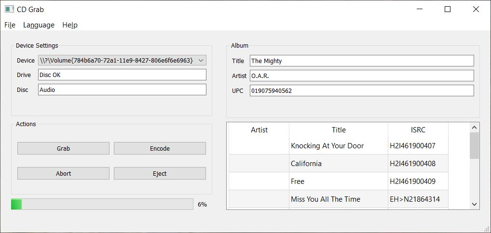

[](https://travis-ci.com/ThijsWithaar/CD-Grab)
[](LICENSE)
[](https://GitHub.com/ThijsWithaar/CD-Grab/releases/)


# Introduction

Cd-Grab is a copier/archiver for audio-cd's. It checks for errors during reading and re-reads sectors the same data has been seen twice.




# Why ?

Mostly to scratch an itch. Also [EAC][4] is not available under Linux.
The audio tooling under Linux requires multiple tools, which are not always very user friendly.
Cd-Grab starts, and read whatever is in the drive to the (lossless) .cue/.flac format.
This can both be played or [processed further][2].

# Features

- Cross-platform (Windows & Linux)
- Per-sector CRC check: Only re-reads what's absolutely necessary.
- Only stores what's aboslutely necessary (1 copy per sector).
- Reads the disc sequentially, this is the most efficient way of reading,
 This also prevents reading errors coming twice out of the disc cache.
- CD-Text and [freeDB][3] support with local cache, so the resulting files have metadata.
- Gapless: Output into a single flac+cue image.


## Mount Fuji Commands

Cd-Grab uses the SCSI interface, and the underlying Generic Packet Format for most of the non-audio commands. This standard set of commands, the Mt. Fuji or [SFF8090i (v5)][7] standard is still implemented on all CD-drives.

It provides a more capable interface than the high level CD-Rom APIS provided by [Windows][5] and [Linux][6].
Mount Fuji commands allow, for example, getting the table-of-contents, UPC and ISRC codes and CD-Text.


## Local CDDB archive

The CDDB supports a local archive of CDDB entries.
With a Audio-CD in the drive, an entry can be generated using
the [cd-discid and cddb-tools][1]:
```
	cd-discid /dev/cdrom | xargs cddb-tool template > ../xmcd/editMe
```
The CDDB class scans for a folder 'xmcd' and parses all files in
that folder.
The entries in this format can be mailed to freedb-submit@freedb.org.
The subject of the message needs to be "cddb genre disc-id" where genre and disc-id are replaced with the appropriate values for your disc.

[1]: https://ubuntuforums.org/showthread.php?t=1669680&p=10883530#post10883530
[2]: https://flacon.github.io/
[3]: http://www.freedb.org/
[4]: http://www.exactaudiocopy.de/
[5]: https://docs.microsoft.com/en-us/windows-hardware/drivers/ddi/content/ntddcdrm/ni-ntddcdrm-ioctl_cdrom_raw_read
[6]: https://github.com/torvalds/linux/blob/master/include/uapi/linux/cdrom.h
[7]: http://www.t10.org/ftp/t10/document.00/00-361r0.pdf
